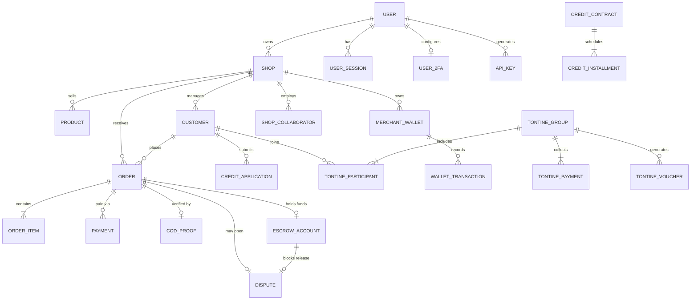

---

```markdown
# 🏛️ Modèle de Données (Domain Model)

**Version** : v5.1.0  
**Dernière mise à jour** : 2026-10-03  
**Paradigme** : Domain-Driven Design (DDD) avec séparation stricte entre Entités, Value Objects et Agrégats.

---

---

## 📋 Table des matières
1. [Entités Centrales (Core)](#1-entités-centrales-core)
2. [Commerce & Commandes](#2-commerce--commandes)
3. [Finance & Portefeuille](#3-finance--portefeuille)
4. [Fonctionnalités Avancées](#4-fonctionnalités-avancées)
5. [Sécurité & Contrôle d'Accès](#5-sécurité--contrôle-daccès)
6. [Relations Clés (Diagramme)](#6-relations-clés-diagramme)

---

## 1. Entités Centrales (Core)

### 👤 User (Utilisateur Authentifié)
Représente l'identité numérique et les credentials d'accès au système.
- `id` (UUID), `email` (unique), `password_hash` (bcrypt, coût ≥ 10).
- `role` (super_admin, admin, merchant, user, credit_analyst, support_agent, moderator).
- `is_active` (bool), `status` (active, pending, suspended, banned).
- `failed_login_attempts` (int), `locked_until` (timestamptz, nullable).
- `created_at`, `updated_at`.
> *Note v4.5.0* : Le rôle par défaut à l'inscription publique est strictement `"user"` pour prévenir toute élévation de privilèges.

### 🏪 Shop (Boutique / Multi-tenant)
L'agrégat racine pour l'isolation des données.
- `id` (UUID), `name`, `slug` (unique), `custom_domain` (unique, nullable).
- `owner_id` (UUID → User.id).
- `logo_url`, `theme` (JSONB), `plan` (free, pro, business).
- `is_active` (bool), `db_schema` (varchar, réservé pour migration Phase 2).
- **v4.1.0/4.2.0** : `kyc_status` (pending, verified, rejected), `health_score` (int), `health_level` (excellent, good, warning, critical), `suspended_at`, `suspension_reason`.

### 👥 Customer (Client / Acheteur)
Représente le profil d'achat au sein d'une boutique spécifique.
- `id` (UUID), `shop_id` (UUID → Shop.id).
- `user_id` (UUID → User.id, nullable mais **recommandé** pour le routage des notifications WebSocket v4.5.0).
- `first_name`, `last_name`, `phone`, `email`.
- `kyc_level` (none, pending, verified, rejected), `kyc_validated_at`, `kyc_validated_by`.
- `created_at`, `updated_at`.

### 📦 Product (Produit)
- `id` (UUID), `shop_id` (UUID).
- `name`, `description`, `category`.
- `price_cents` (int64, **toujours en centimes FCFA**), `stock` (int).
- `images` (TEXT[]), `is_active` (bool).
- `created_at`, `updated_at`, `deleted_at` (soft delete).

---

## 2. Commerce & Commandes

### 🛒 Order (Commande)
- `id` (UUID), `shop_id` (UUID), `customer_id` (UUID).
- `total_amount_cents` (int64), `status` (pending_confirmation, confirmed, out_for_delivery, delivered, cancelled, expired).
- `payment_method` (cash_on_delivery, wave, orange_money, moov_money, yenga_pay, credit).
- `reserved_until` (timestamptz, pour le blocage temporaire du stock en COD).
- `created_at`, `updated_at`.

### 🧾 OrderItem (Ligne de commande)
- `id` (UUID), `order_id` (UUID), `product_id` (UUID).
- `quantity` (int), `unit_price_cents` (int64), `subtotal_cents` (int64).

### 🚚 CODProof (Preuve de Livraison Cash)
- `id` (UUID), `order_id` (UUID), `shop_id` (UUID).
- `client_proof_url` (string, nullable), `merchant_proof_url` (string).
- `amount_received_cents` (int64), `commission_collected_cents` (int64).
- `status` (pending_client, pending_merchant, collected, disputed).

---

## 3. Finance & Portefeuille

### 💳 MerchantWallet (Portefeuille Marchand)
Agrégat financier par boutique (`shop_id` = clé métier / PK en base).

| Champ | Type | Notes |
|-------|------|--------|
| `shop_id` | UUID | PK / FK → `shops.id` |
| `balance_cents` | int64 | Solde ledger |
| `held_cents` | int64 | Fonds non disponibles (escrow, hold tontine) — **≥ 0** |
| `debt_cents` | int64 | Dette résiduelle post-clawback — **≥ 0** (v5.1) |
| `is_frozen` | bool | Gel compte (admin / legacy négatif / fraude) |
| `frozen_at`, `frozen_reason`, `frozen_until` | … | Métadonnées de gel |
| `max_negative_balance_cents` | int64 | Plafond legacy solde négatif (défaut env. −100000) |
| `total_sales_cents` | int64 | Cumul ventes |
| `total_commissions_cents` | int64 | Cumul commissions plateforme |
| `total_payouts_cents` | int64 | Cumul retraits |
| `created_at`, `updated_at` | timestamptz | |

**Dérivés métier :**
- `AvailableCents() = max(0, balance_cents − held_cents)`
- Retrait autorisé seulement si `!is_frozen` **et** `debt_cents == 0` **et** `available > 0`

**Opérations domaine (v5.1) :**
- `ApplyClawbackToDebt(amount)` — débit balance puis reste → `debt_cents` (pas de freeze)
- `CreditWithDebtSweep(amount)` — crédit net après remboursement dette
- `ReleaseHeld(amount)` — held ↓ ; le disponible augmente ; un sweep dette peut suivre côté usecase

> Détail flux : [12-wallet-debt-sweep.md](12-wallet-debt-sweep.md)

### 📜 WalletTransaction (Historique Mouvements)
- `id` (UUID), `shop_id` (UUID).
- `transaction_type` — notamment : crédit vente, refund, payout, **clawback**, **debt_add**, **debt_sweep**, commission, etc.
- `amount_cents` (int64 ; négatif pour débits / sweep).
- `balance_after_cents` (int64).
- `reference_type`, `reference_id` (nullable — order, dispute, debt_sweep…).
- `description` (nullable), `status` (ex. completed).
- `created_at`.

### 🏦 EscrowAccount (Séquestre commande)
- `order_id`, `shop_id`, montants séquestrés.
- Statuts typiques : `funds_held` → `disputed` → `released` | `refunded`.
- Un litige ouvert bloque l’auto-release ; `customer_wins` post-release déclenche clawback wallet.

### ⚖️ Dispute (Litige)
- Lié à `order_id` / escrow.
- Résolutions : `resolved_customer` (clawback + éventuelle dette), `resolved_merchant` (crédit / claim release + sweep si dette).

### 💸 Payment (Transaction de Paiement Externe)
- `id` (UUID), `shop_id` (UUID), `order_id` (UUID, nullable pour tontine/crédit).
- `provider` (wave, orange_money, moov_money, yenga_pay).
- `amount_cents` (int64), `provider_fee_cents` (int64), `net_amount_cents` (int64).
- `provider_ref` (string), `customer_phone` / metadata (canal pay-in pour refund).
- `status` (pending, processing, success, failed, refunded).
- `metadata` (JSONB, audit webhook — ex. `payment_source`, MSISDN).

### 🏧 Withdrawal (Demande de Retrait)
- `id` (UUID), `shop_id` (UUID).
- `amount_cents` (int64), `provider` / `payment_method`, `destination_number`.
- `status` (pending, processing, success, failed, rejected).
- **Gates** : KYC marchand vérifié, wallet non gelé, **`debt_cents == 0`**, `amount ≤ available_cents`.


## 4. Fonctionnalités Avancées

### 💰 Crédit à la Consommation (v3.x)
- **CreditPlan** : `shop_id`, `down_payment_pct`, `installments_count`, `interval_days`, `interest_rate_pct` (max 15% conforme BCEAO).
- **CreditApplication** : `customer_id`, `amount_requested_cents`, `status` (pending, approved, rejected).
- **CreditContract** : `application_id`, `total_amount_cents`, `monthly_payment_cents`, `status` (active, completed, defaulted), `down_payment_paid` (bool).
- **CreditInstallment** : `contract_id`, `sequence`, `amount_cents`, `due_date`, `status` (pending, paid, late), `penalty_cents`.
- **CreditScore** : `customer_id`, `score` (int, 300-850), `on_time_payments`, `late_payments`, `defaults`.

### 🤝 Tontine de Biens Physiques (v2.9.0)
- **ProductTontineSettings** : `product_id`, `is_enabled`, `min_participants`, `max_participants`.
- **TontineGroup** : `product_id`, `shop_id`, `creator_customer_id`, `circle_type` (family, corporate, commercial), `amount_per_cycle_cents`, `total_cycles`, `current_cycle`, `invite_code`, `status` (pending_members, active, completed).
- **TontineParticipant** : `group_id`, `customer_id`, `payout_position` (int).
- **TontinePayment** : `group_id`, `participant_id`, `cycle_number`, `amount_cents`, `commission_cents`, `status` (pending, success).
- **TontineVoucher** : `group_id`, `participant_id`, `product_id`, `shop_id`, `voucher_code` (12 chars), `cycle_number`, `status` (generated, redeemed), `expires_at`.

---

## 5. Sécurité & Contrôle d'Accès (v4.x)

### 🔑 UserSession (Gestion des Sessions v4.4.2)
- `id` (UUID), `user_id` (UUID).
- `token_hash` (SHA-256 du refresh token), `ip_address`, `user_agent`.
- `expires_at` (timestamptz), `revoked_at` (timestamptz, nullable).

### 🛡️ User2FA (Authentification à 2 facteurs v4.4.0)
- `user_id` (UUID, PK).
- `secret_key` (chiffré), `is_enabled` (bool).
- `recovery_codes` (JSONB, hachés), `backup_codes_used` (int).

### 🔌 APIKey (Intégrations Tierces v4.4.3)
- `id` (UUID), `user_id` (UUID).
- `name`, `key_prefix` (ex: `gsk_live_...`), `key_hash` (SHA-256).
- `scopes` (JSONB, ex: `["read:products", "write:orders"]`).
- `last_used_at`, `revoked_at`.

### 👥 Collaborators (v4.3.0)
- **ShopCollaborator** : `shop_id`, `user_id`, `role` (shop_admin, manager, support), `status` (active, revoked), `invited_by`, `accepted_at`.
- **PlatformCollaborator** : `user_id`, `role` (super_admin, admin, credit_analyst), `status`, `invited_by`.
- **CollaboratorInvitation** : `email`, `role`, `token` (unique), `expires_at`, `accepted`.

### 🪪 CustomerKYCDocument (v2.9.0)
- `id` (UUID), `customer_id` (UUID), `shop_id` (UUID).
- `document_type` (cni, passport, other), `file_path`, `file_size_bytes`, `mime_type`.
- `status` (pending, verified, rejected), `reviewed_by`, `rejection_reason`.

---

## 6. Relations Clés (Diagramme Conceptuel)



> **🛡️ Règle d'Or Multi-tenant** :  
> Toutes les entités métier (`Product`, `Customer`, `Order`, `Payment`, etc.) possèdent une colonne `shop_id`. **Toutes** les requêtes doivent être filtrées par ce `shop_id` (injecté via le contexte HTTP), et l'accès est doublement vérifié par le middleware `RequireShopAccess` (v4.5.0).
```

---
